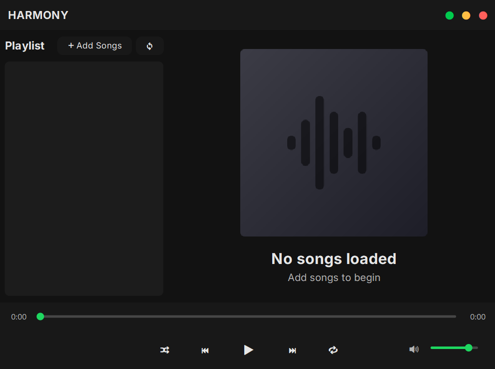

# 🎵 Harmony Music Player

A lightweight desktop music player built with Java, designed for simplicity and speed. This app supports basic MP3 playback and has a clean GUI interface using Java Swing.

## 🚀 Features

- 🎧 Play, pause, and stop music
- 📂 Load `.mp3` files from your system
- 📃 Minimal and clean Swing-based UI
- ⚙️ Built using Java `javax.sound.sampled` API

## 📦 Download & Installation

1. Head over to the [Releases](https://github.com/rijul-mahajan/Harmony-Music-Player/releases) section.
2. Download the latest `.exe` file for Windows.
3. Double-click to run — no installation required!

> ⚠️ Java is not required on the end user's machine. The EXE is packaged with a JRE using `jpackage`.

## 🖥️ Screenshots



## 💡 How It Works

The player loads an audio file using Java's `AudioInputStream` and plays it on a separate thread to keep the UI responsive. It uses basic controls for playback and is packaged as a Windows executable using `jpackage`.

## 🔧 Build From Source

To run from source:

```bash
javac MusicPlayer.java
java MusicPlayer
```

Requirements:

- Java Development Kit (JDK 8 or higher)

## 📁 Packaging Notes

- The EXE was generated using `jpackage`.
- Ensure `.wav` or compatible formats are tested; support for `.mp3` may require external libraries like `javazoom`.

## 📦 Initial Release Notes (v1.0.0)

- ✅ Packaged into a single Windows `.exe`
- ✅ Basic play/pause/stop controls implemented
- ✅ GUI built with Swing
- ✅ Lightweight and minimal dependencies
- ✅ No Java installation needed on target machine

## 🤝 Contributing

Pull requests are welcome! If you have suggestions for features or improvements, feel free to fork the repo and submit a PR.

## 📝 License

This project is open source and available under the [MIT License](https://github.com/rijul-mahajan/Harmony-Music-Player/blob/main/LICENSE).
